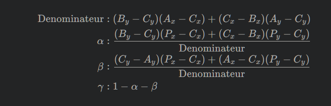

# Coordonnées barycentriques

Les `coordonnées barycentriques` sont **une méthode de représentation des coordonnées d'un point à l'intérieur d'un triangle en termes de poids relatifs des sommets du triangle. Ces coordonnées permettent de décrire la position d'un point comme une combinaison linéaire des coordonnées des sommets du triangle**.

- La fonction `calculateBarycentricCoordinates` est utilisée pour calculer les coordonnées barycentriques d'un point par rapport à un triangle donné. Elle prend en entrée les `coordonnées *p* du point` et les `coordonnées *u, v, w* des sommets du triangle`, puis elle retourne les coefficients `alpha`, `beta` et `gamma` qui représentent les coordonnées barycentriques du point.

- La fonction `isBarycentricInsideTriangle` est **utilisée pour déterminer si un point est à l'intérieur du triangle en se basant sur les coordonnées barycentriques calculées**. Elle prend en entrée les `coordonnées barycentriques` et vérifie si elles sont dans la plage [0, 1] avec une marge d'erreur `epsilon`. Si les coordonnées barycentriques sont dans cette plage, le point est considéré comme étant à l'intérieur du triangle.

En résumé, **ces fonctions permettent de convertir les coordonnées d'un point en coordonnées barycentriques par rapport à un triangle et de déterminer si ce point se trouve à l'intérieur du triangle en se basant sur ces coordonnées**. Ces concepts sont particulièrement utiles dans la géométrie et la détection de positions dans des espaces triangulés, par exemple, pour déterminer si un point se trouve à l'intérieur d'une zone délimitée par plusieurs triangles.

## Marge d'erreur `epsilon`

La marge d'erreur `epsilon` est introduite pour **traiter les approximations numériques liées à la représentation des nombres flottants dans les ordinateurs**. En raison des limites de précision des calculs en virgule flottante, il peut y avoir de petites erreurs numériques lors des calculs, ce qui **peut conduire à des résultats légèrement en dehors de la plage attendue, même si le point est mathématiquement à l'intérieur du triangle**.

En ajoutant une marge d'erreur, généralement sous la forme d'une petite valeur positive (epsilon), on permet une certaine **tolérance aux petites variations numériques**. Ainsi, un point dont les coordonnées barycentriques se situent dans la plage `0 - epsilon, 1 + epsilon` est considéré comme étant à **l'intérieur du triangle**.

La valeur spécifique d'epsilon dépend souvent du contexte et de la précision numérique requise. En général, elle est choisie de manière à être suffisamment petite pour traiter les erreurs numériques, tout en évitant de considérer des points situés loin du triangle comme étant à l'intérieur en raison de ces erreurs.

## Coordonnées barycentriques et tests d'appartenance à un triangle

Oui, les fonctions `calculateBarycentricCoordinates` et `isBarycentricInsideTriangle` sont basées sur des concepts mathématiques spécifiques liés aux coordonnées barycentriques et aux tests d'appartenance à un triangle.

### Coordonnées Barycentriques

La formule pour calculer les coordonnées barycentriques d'un point \(P\) par rapport à un triangle défini par ses sommets \(A\), \(B\), et \(C\) est la suivante :

Ces coordonnées décrivent la position du point \(P\) par rapport aux sommets du triangle \(A\), \(B\), \(C\).

### Test d'appartenance à un Triangle

La fonction `isBarycentricInsideTriangle` utilise les coordonnées barycentriques calculées par la fonction précédente. Le test d'appartenance vérifie si les coordonnées barycentriques sont dans la plage [0 - epsilon, 1 + epsilon] pour être considérées comme à l'intérieur du triangle. L'introduction de la marge d'erreur (\( \epsilon \)) est nécessaire pour gérer les erreurs numériques.

- Le test se fait en vérifiant que toutes les coordonnées barycentriques (\(\alpha\), \(\beta\), \(\gamma\)) sont dans la plage spécifiée.

Ces formules sont des concepts fondamentaux pour le rendu graphique et la géométrie computationnelle. La coordination entre ces coordonnées barycentriques permet de déterminer si un point est à l'intérieur d'un triangle, une opération fréquemment utilisée dans le rendu graphique.
